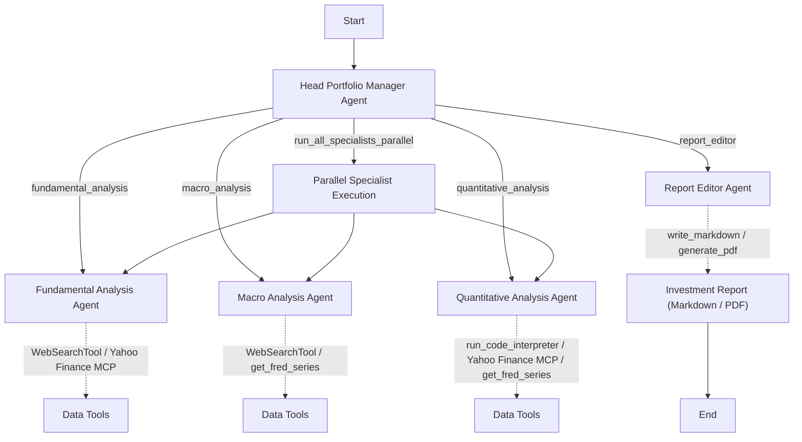

# Portfolio Research Multi-Agent System

This repository contains a multi-agent workflow that answers investment research questions, combining fundamental, macro, and quantitative analyses. The agents collaborate to generate a structured Markdown investment report (and optional PDF) using OpenAI function-calling tools and the new **openai-agents** SDK.

## Features

* **Head Portfolio Manager (PM)** agent orchestrates specialist agents and report editing.
* **Fundamental, Macro, Quantitative** specialist agents leverage Web search, Yahoo Finance MCP, FRED data, and Code Interpreter.
* **Report Editor** agent stitches all analysis sections into a polished Markdown report and can convert it to PDF.
* CLI script (`main.py`) and Streamlit app (`streamlit_app.py`) provide two ways to run the workflow.

## Quick Start

1. **Install dependencies** (including optional visualization extras):

   ```bash
   pip install -r requirements.txt
   # For Graphviz-based diagrams
   pip install "openai-agents[viz]" graphviz
   ```

2. **Set environment variables** (required):

   ```bash
   export OPENAI_API_KEY="<your-openai-key>"
   export FRED_API_KEY="<your-fred-key>"  # Required for Macro agent
   ```

3. **Run from the command line**:

   ```bash
   python main.py --question "How would the planned interest rate reduction affect my holdings in GOOGL?" --risk Medium
   ```

4. **Launch Streamlit UI**:

   ```bash
   streamlit run streamlit_app.py
   ```

The generated report is saved under the `outputs/` directory.

## Configuration

Most default values (LLM model, search-context size, timeouts, max reasoning turns) live in `settings.py` and can be overridden via environment variables:

```bash
# examples – all optional
export DEFAULT_LLM_MODEL="gpt-4o-mini"
export DEFAULT_PM_MODEL="gpt-o4-mini"
export DEFAULT_SEARCH_CONTEXT="large"   # WebSearchTool context window
export YAHOO_MCP_TIMEOUT=600             # seconds
export DEFAULT_MAX_TURNS=100             # agent reasoning turns cap
```

If an env variable is set, it takes precedence over the constant in `settings.py` – no code changes required.

---

## Architecture

Below is a high-level diagram of the agent workflow, tools, and hand-offs.



---

## Directory Layout

```
financial_agents/    # Agent builders and configurations
prompts/             # Prompt templates for each agent type
tools/               # Function tools & MCP servers (Yahoo Finance, FRED, etc.)
outputs/             # Generated data files and reports (ignored by git)
main.py              # CLI entry point
streamlit_app.py     # Streamlit UI
research_workflow.py # Shared asyncio workflow helper
settings.py          # Centralised defaults for models, timeouts, etc.
```

## Contributing

1. Fork and clone the repo.
2. Create a virtual environment and install dependencies.
3. Make your changes in a feature branch.
4. Submit a pull request with a clear description of your changes.

## License

MIT