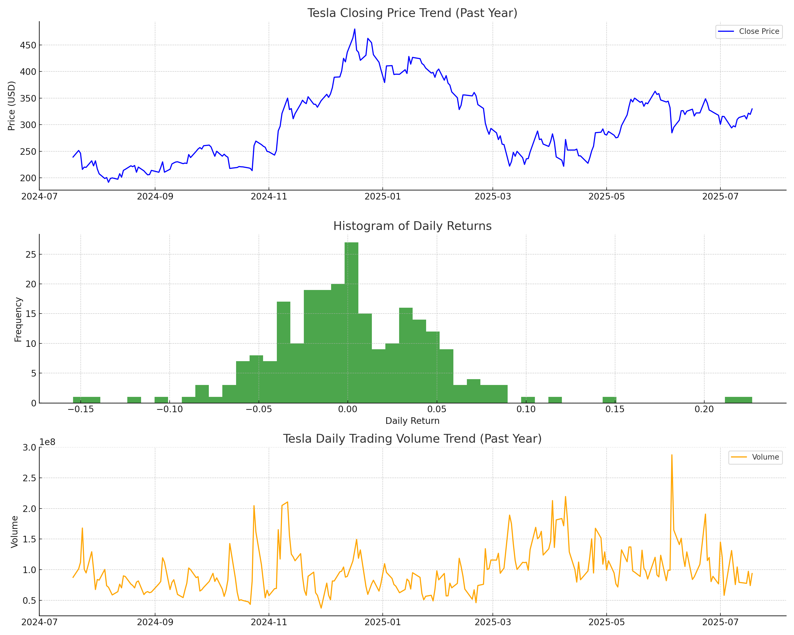

# Tesla Inc. Investment Report - Mid 2025

## Executive Summary

Tesla Inc. remains a compelling high-growth investment opportunity as of mid-2025, driven by its leadership in electric vehicles, autonomous driving technology, and energy solutions. The investment thesis aligns closely with our firm's vision of uncovering original, well-reasoned insights that go beyond consensus narratives. Tesla's vertically integrated business model, innovation pipeline, and expansion into autonomous mobility services and affordable EV segments represent differentiated strategic advantages that many competitors have yet to replicate fully.

While consensus generally supports Tesla's growth trajectory, our synthesis highlights nuanced medium-term risks that warrant careful scenario planning. These include supply chain vulnerabilities, regulatory scrutiny on autonomous driving, intensifying competition from global EV manufacturers, and geopolitical tensions impacting market access, especially in China. The quantitative analysis reveals high stock price volatility and anomalous trading days, suggesting shifts in market sentiment that may not be fully captured by consensus technical patterns.

Key risks include the potential abrupt removal of regulatory credits and EV tax incentives, tariff escalations affecting production costs, and execution risks in scaling new business lines like Robotaxi and Model 2. Conversely, opportunities lie in Tesla's ability to innovate rapidly, secure regulatory approvals for Full Self-Driving technology, and capitalize on expanding energy storage markets. Our thesis incorporates both best- and worst-case scenarios, emphasizing active monitoring and risk management.

## Fundamentals Perspective

Tesla's fundamentals remain robust, with a market capitalization reflecting its dominant position in the consumer cyclical sector. The stock trades at a trailing P/E of approximately 161 and a forward P/E near 80, indicating high growth expectations priced in by the market. For fiscal year 2024, Tesla reported net income of about $7.13 billion on revenues nearing $97.7 billion, underscoring solid top-line growth.

The company's moat is anchored in its vertically integrated model, combining EV manufacturing, proprietary battery technology, AI-driven autonomous software, and energy solutions. Key catalysts include the June 2025 launch of the Tesla Robotaxi in Austin, ramp-up of the affordable Model 2 at Gigafactory Texas, and ongoing advancements in Full Self-Driving technology. These initiatives could unlock new revenue streams and broaden Tesla's market reach.

However, risks are material. Supply chain disruptions, particularly tariffs and geopolitical tensions involving China, could increase costs and delay production. Regulatory scrutiny on autonomous driving technology poses potential delays or restrictions. Competition from players like BYD is intensifying, threatening Tesla's market share. Recent sales declines and leadership changes in North American sales management highlight demand volatility concerns.

This fundamental view aligns with consensus optimism but adds a variant perspective emphasizing medium-term execution and regulatory risks. The analysis is supported by strong financial data but acknowledges limited visibility on the long-term financial impact of autonomous services and the effectiveness of recent sales leadership changes.

## Macro Perspective

The macroeconomic environment presents a mixed but challenging backdrop for Tesla. U.S. GDP growth is moderate at $29.962 trillion as of January 2025, with a stable labor market reflected by a 4.1% unemployment rate in June 2025. Inflation remains moderate, with the CPI at 321.5, while energy costs have eased, with WTI crude oil prices at $68.17 per barrel.

Significant policy headwinds include the potential elimination of federal EV tax credits and regulatory credits, which have historically supported Tesla's profitability and demand. Trade tensions, especially tariffs on imports from Canada and Mexico, could raise production costs. Geopolitical risks, notably U.S.-China relations, threaten Tesla's expansion in China, where domestic competitors are gaining ground.

Technological policy changes around autonomous driving and AI regulation add uncertainty to Tesla's innovation trajectory. Additionally, reputational risks linked to Elon Musk's political affiliations may influence investor sentiment.

Consensus expects growth to slow due to these macro challenges, with profitability pressured by the loss of regulatory credits. A variant view highlights Tesla's technological leadership and brand strength as potential buffers against macro risks. Investors should monitor policy developments, trade relations, and competitive dynamics closely.

## Quantitative Perspective

Tesla's stock exhibits high annualized volatility of approximately 73.79% over the past year, indicating significant price fluctuation risk. Average daily trading volume is robust at about 98.9 million shares, reflecting strong market interest and liquidity.

The attached chart file  illustrates Tesla's closing price trend, daily returns distribution, and volume trends over the past year. The anomalies file below highlights six dates with statistically significant deviations in price returns or volume, suggesting potential early signals of shifts in market sentiment beyond consensus technical patterns.

| Date       |   Open |   High |    Low |   Close |    Volume |   Daily_Return |
|:-----------|-------:|-------:|-------:|--------:|----------:|---------------:|
| 2024-10-24 | 244.68 | 262.12 | 242.65 |  260.48 | 204,491,900 |      0.21919   |
| 2024-11-06 | 284.67 | 289.59 | 275.62 |  288.53 | 165,228,700 |      0.14751   |
| 2025-03-10 | 252.54 | 253.37 | 220.00 |  222.15 | 189,076,900 |     -0.15426   |
| 2025-04-02 | 254.60 | 284.99 | 251.27 |  282.76 | 212,787,800 |      0.05327   |
| 2025-04-09 | 224.69 | 274.69 | 223.88 |  272.20 | 219,433,400 |      0.22690   |
| 2025-06-05 | 322.49 | 324.55 | 273.21 |  284.70 | 287,499,800 |     -0.14260   |

These anomalies may represent alternative signals to consensus technical patterns, potentially indicating shifts in momentum or investor sentiment. However, the quantitative analysis is limited by its reliance on historical price and volume data without full integration of forward-looking fundamental or macro factors.

## Portfolio Manager Perspective

The PM concurs with the medium risk assessment, emphasizing Tesla's strong fundamental innovation and market presence balanced against supply chain vulnerabilities, regulatory uncertainties, and competitive pressures. The macro environment adds complexity with policy headwinds and geopolitical risks that could impact growth and profitability.

From a portfolio management standpoint, Tesla's growth prospects remain compelling due to its technological leadership and expansion into autonomous services and affordable EVs. However, a cautious stance is warranted, with active monitoring of execution on growth catalysts, regulatory developments, and geopolitical dynamics. The PM highlights the importance of considering alternative scenarios such as supply chain disruptions or adverse policy changes in risk management and position sizing.

The quantitative files provide valuable tools for ongoing monitoring and deeper analysis to inform tactical decisions.

## Recommendation & Answer to the Question

We recommend a cautiously optimistic stance on Tesla as a high-growth but medium-risk investment. This recommendation embodies our firm's vision by integrating original, evidence-based insights across fundamental, macro, and quantitative perspectives, and by explicitly planning for both best- and worst-case scenarios.

Tesla's differentiated innovation pipeline, vertical integration, and expansion into autonomous mobility and affordable EV segments offer unique growth opportunities that justify a premium valuation. However, investors must remain vigilant to medium-term risks from supply chain disruptions, regulatory scrutiny, and intensifying competition.

Active risk management, scenario planning, and ongoing monitoring of Tesla's execution and macro developments are essential. This approach aligns with our firm's edge in developing novel, differentiated investment theses that do not simply follow consensus but are grounded in rigorous analysis and forward-looking risk assessment.

---

*DISCLAIMER: This report is for informational purposes only and does not constitute investment advice. Please consult a qualified financial professional before making investment decisions.*
